# Planday Clone - Tech Stack mit Clerk + Maileroo (Railway Deployment)

## Executive Summary

Komplettes Workforce Management System mit **optimaler Balance** zwischen Open Source und bewährten SaaS-Tools:

- ✅ **Clerk** für Auth + Payment (schnellere Time-to-Market)
- ✅ **Maileroo** für Emails (günstig & zuverlässig)
- ✅ **Open Source** für Rest (PostgreSQL, Redis, Monitoring, etc.)
- ✅ **Railway** für Hosting (einfach & günstig)

**Kernzielgruppe**: KMUs mit 10-500 Mitarbeitern in schichtbasierten Branchen

---

## 1. Tech Stack - Optimale Balance

### 1.1 Frontend Web

**Framework & Core:**

- **Next.js 15** (App Router, React Server Components)
- **React 19** (neueste)
- **TypeScript 5.7** (neueste)
- **Node.js 22.x LTS** (neueste)

**UI & Styling:**

- **Tailwind CSS 4.0** (neueste)
- **shadcn/ui** (MIT License) + Radix UI
- **Lucide Icons** (ISC License)
- **Framer Motion 11.x** (MIT License)

**State Management:**

- **Zustand 5.x** (MIT License)
- **TanStack Query v5** (MIT License)

**Forms & Validation:**

- **React Hook Form 7.x** (MIT License)
- **Zod 3.x** (MIT License)

**Calendar/Scheduling:**

- **@fullcalendar/react 6.x** (MIT License)
- **@dnd-kit/core** (MIT License) - Drag & Drop
- **date-fns 4.x** (MIT License)

**Charts:**

- **Recharts 2.x** (MIT License)
- **Apache ECharts** (Apache 2.0)

**Real-time:**

- **Socket.io 4.x Client** (MIT License)

### 1.2 Mobile Apps

**Framework:**

- **React Native 0.76.x** (MIT License)
- **Expo SDK 52** (MIT License)
- **Expo Router** (file-based routing)

**State & Data:**

- **Zustand 5.x** (MIT License)
- **TanStack Query v5** (MIT License)

**Native Features:**

- **expo-location** - GPS/Geolocation
- **expo-camera** - Check-in Fotos
- **expo-notifications** - Push Notifications
- **react-native-firebase** (Apache 2.0) - FCM

**UI:**

- **React Native Paper 5.x** (MIT License)
- **Tamagui** (MIT License)

### 1.3 Backend API

**Framework:**

- **NestJS 10.x** (MIT License)
- **Fastify** (MIT License) - schneller als Express
- **TypeScript 5.7**
- **Node.js 22.x LTS**

**API Tools:**

- **Swagger/OpenAPI 3.1** (Apache 2.0)
- **Class-validator** (MIT License)
- **Class-transformer** (MIT License)

**Testing:**

- **Vitest** (MIT License) - schneller als Jest
- **Supertest** (MIT License)
- **Playwright** (Apache 2.0) - E2E

### 1.4 Authentication & Payment (SaaS)

**Clerk** - All-in-One Auth + Payment ✅

**Warum Clerk?**

- ✅ Auth + Payment in einem System
- ✅ Pre-built UI Components (schnellere Entwicklung)
- ✅ Multi-Tenancy Support
- ✅ SSO, MFA, OAuth built-in
- ✅ User Management Dashboard
- ✅ Webhooks
- ✅ B2B Features
- ✅ Subscription Billing
- ✅ Stripe Integration (managed)

**Clerk Features:**

```typescript
// Auth
- Email/Password
- Magic Links
- OAuth (Google, Microsoft, GitHub, etc.)
- SSO (SAML, OIDC)
- MFA/2FA
- Session Management
- JWT Tokens
- Webhooks

// Payment (via Clerk Payments)
- Subscription Management
- Stripe Integration
- Usage-based Billing
- Invoice Generation
- Payment Methods Management
- Dunning Management
```

**Pricing:**

- **Free**: 10,000 MAU (Monthly Active Users)
- **Pro**: $25/Monat + $0.02/MAU
- **Enterprise**: Custom Pricing

**Für 1000 aktive User:**

```
$25/Monat (Base) + (1000 × $0.02) = $45/Monat
```

### 1.5 Email Service (SaaS)

**Maileroo** - Email Delivery ✅

**Warum Maileroo?**

- ✅ Günstiger als SendGrid/Mailgun
- ✅ Hervorragende Deliverability
- ✅ DKIM, SPF, DMARC included
- ✅ API-first
- ✅ Templates Support
- ✅ Webhooks (Bounce, Click, Open)
- ✅ SMTP + HTTP API
- ✅ EU Server verfügbar (GDPR)

**Features:**

```typescript
- Transactional Emails
- Marketing Emails
- Email Templates
- Bounce Handling
- Click/Open Tracking
- Webhooks
- Analytics
- EU & US Regions
```

**Pricing:**

- **Starter**: $9/Monat - 10,000 Emails
- **Growth**: $29/Monat - 50,000 Emails
- **Business**: $79/Monat - 200,000 Emails
- **Custom**: Ab $199/Monat

**Für 1000 User** (≈5000 Emails/Monat):

```
$9/Monat (Starter Plan)
```

**Alternative Email-Lösungen:**

- **Resend** ($20/Monat für 50k Emails) - Developer-freundlich
- **Amazon SES** (Pay-as-you-go: $0.10 per 1000 Emails)
- **Postmark** ($15/Monat für 10k Emails) - Premium Deliverability

### 1.6 Datenbanken (Open Source)

**Primary Database:**

- **PostgreSQL 17** (neueste, PostgreSQL License)
- **Railway Managed PostgreSQL** (automatische Backups)

**ORM:**

- **Drizzle ORM** (Apache 2.0) - modernste Type-Safe ORM
- **Alternative**: Prisma 6.x (Apache 2.0)

**Extensions:**

- **TimescaleDB** (Apache 2.0) - Time-Series
- **PostGIS** (GPL v2) - Geospatial
- **pgvector** (PostgreSQL License) - AI/ML Features

**Caching & Jobs:**

- **Redis 7.4** (BSD-3-Clause)
- **Railway Managed Redis**
- **BullMQ 5.x** (MIT License) - Job Queue

### 1.7 File Storage (Open Source + Cloud)

**Options:**

**Option 1: Cloudflare R2** (S3-compatible, empfohlen) ✅

- 10 GB Storage kostenlos
- $0.015/GB danach
- Keine Egress-Gebühren!
- S3-kompatible API
- CDN included
- GDPR-compliant (EU Region)

**Option 2: AWS S3**

- Standard S3 Pricing
- Mit CloudFront CDN
- Lifecycle Policies

**Option 3: MinIO** (self-hosted auf Railway)

- AGPL v3 License
- S3-kompatibel
- Self-hosted Option

**Empfehlung für Railway**: **Cloudflare R2**

- Günstig
- Keine Egress-Gebühren
- Einfache Integration
- Perfekt für SaaS

### 1.8 Monitoring & Logging (Open Source)

**Application Performance:**

- **Grafana** (AGPL v3) - Dashboards
- **Prometheus** (Apache 2.0) - Metrics
- **Loki** (AGPL v3) - Log Aggregation
- **Tempo** (AGPL v3) - Tracing

**Error Tracking:**

- **Sentry** (self-hosted, BSL)
- **GlitchTip** (MIT License) - Sentry-kompatibel

**Uptime Monitoring:**

- **Uptime Kuma** (MIT License) - self-hosted
- **Better Uptime** (hat Free Tier)

**Empfehlung**: **Grafana Stack + Sentry**

### 1.9 Analytics (Open Source)

**Web Analytics:**

- **Umami** (MIT License) - EMPFOHLUNG
  - Privacy-first
  - GDPR-compliant
  - Lightweight
  - Self-hosted auf Railway
- **Plausible** (AGPL v3) - Alternative

**Product Analytics:**

- **PostHog** (MIT License) - self-hosted
  - Session Recording
  - Feature Flags
  - A/B Testing
  - Heatmaps

### 1.10 Search Engine (Open Source)

**Full-Text Search:**

- **Meilisearch** (MIT License) - EMPFOHLUNG
  - Ultra-schnell
  - Typo Tolerance
  - Faceting
  - Multi-Language
  - Deploy auf Railway
- **Typesense** (GPL v3) - Alternative

### 1.11 Real-Time Communication (Open Source)

**WebSocket:**

- **Socket.io 4.x** (MIT License) - bewährt
- **Soketi** (MIT License) - Pusher Alternative
- **Centrifugo** (MIT License) - hochperformant

### 1.12 Background Jobs (Open Source)

**Job Queue:**

- **BullMQ** (MIT License) - Redis-based, EMPFOHLUNG
  - Email Versand
  - Report Generation
  - Notification Dispatch
  - Scheduled Tasks

**Cron/Scheduling:**

- **node-cron** (ISC License)
- Built-in NestJS Scheduler

### 1.13 SMS Service (Optional SaaS)

**Options:**

- **Twilio** - Standard, bewährt
- **Vonage (Nexmo)** - günstiger
- **MessageBird** - EU-fokussiert
- **Sinch** - gut für Europa

**Für MVP**: Optional weglassen, nur Email & Push

### 1.14 Push Notifications (Free)

**Firebase Cloud Messaging (FCM)**

- Komplett kostenlos
- Unbegrenzte Nachrichten
- iOS & Android
- Web Push

---

## 1.15 System-Architektur Übersicht

Das komplette System besteht aus 3 Haupt-Services, die auf Railway deployed werden:

```mermaid
graph TB
    subgraph External["🌐 External Services"]
        Clerk["🔐 Clerk<br/>Auth + Organizations<br/>+ Payments"]
        Maileroo["📧 Maileroo<br/>Email Delivery"]
        R2["💾 Cloudflare R2<br/>File Storage"]
        FCM["📱 Firebase FCM<br/>Push Notifications"]
    end

    subgraph Railway["🚂 Railway.app - Production"]
        subgraph Apps["Applications"]
            Web["🌐 Web<br/>Next.js 15<br/>:3000"]
            API["⚡ API<br/>NestJS 10<br/>:4000"]
            Worker["⚙️ Worker<br/>BullMQ<br/>:4001"]
        end

        subgraph Data["Databases"]
            Postgres[("🗄️ PostgreSQL 17")]
            Redis[("⚡ Redis 7.4<br/>Cache + Jobs")]
        end
    end

    User["👤 Users"] --> Web
    Web --> API
    API --> Postgres
    API --> Redis
    API --> Clerk
    Worker --> Redis
    Worker --> Postgres
    Worker --> Maileroo
    Worker --> FCM
    Worker --> R2

    style Clerk fill:#4F46E5
    style Web fill:#0070F3
    style API fill:#E0234E
    style Worker fill:#FF6B35
    style Postgres fill:#336791
    style Redis fill:#DC382D
```



### Service-Verantwortlichkeiten

| Service        | Rolle                 | Technologie           | Port |
| -------------- | --------------------- | --------------------- | ---- |
| **Web**        | Frontend & BFF        | Next.js 15 + React 19 | 3000 |
| **API**        | REST API + WebSockets | NestJS 10 + Fastify   | 4000 |
| **Worker**     | Background Jobs       | NestJS 10 + BullMQ    | 4001 |
| **PostgreSQL** | Primary Database      | PostgreSQL 17         | 5432 |
| **Redis**      | Cache + Job Queue     | Redis 7.4             | 6379 |

**Monorepo-Struktur:**

- Alle Services teilen Code via pnpm workspaces
- Shared Packages: `@planday/types`, `@planday/config`, `@planday/database`
- Docker-basiertes Deployment auf Railway

---

## 2. Datenbank-Schema (PostgreSQL + Drizzle ORM)

### 2.1 Core Tables (mit Clerk Integration)

```typescript
// schema.ts - Drizzle ORM Schema
import {
  pgTable,
  uuid,
  varchar,
  text,
  timestamp,
  boolean,
  decimal,
  integer,
  jsonb,
  date,
} from 'drizzle-orm/pg-core';

// Organizations (Multi-Tenancy)
export const organizations = pgTable('organizations', {
  id: uuid('id').primaryKey().defaultRandom(),
  clerkOrgId: varchar('clerk_org_id', { length: 255 }).unique(), // Clerk Organization ID
  name: varchar('name', { length: 255 }).notNull(),
  slug: varchar('slug', { length: 100 }).unique().notNull(),
  logoUrl: text('logo_url'),
  timezone: varchar('timezone', { length: 50 }).default('Europe/Berlin'),
  countryCode: varchar('country_code', { length: 2 }).default('DE'),
  settings: jsonb('settings').default({}),
  subscriptionTier: varchar('subscription_tier', { length: 50 }).default(
    'starter',
  ),
  subscriptionStatus: varchar('subscription_status', { length: 50 }).default(
    'active',
  ), // active, past_due, cancelled
  isActive: boolean('is_active').default(true),
  createdAt: timestamp('created_at').defaultNow(),
  updatedAt: timestamp('updated_at').defaultNow(),
});

// Users (synced from Clerk via Webhooks)
export const users = pgTable('users', {
  id: uuid('id').primaryKey().defaultRandom(),
  clerkUserId: varchar('clerk_user_id', { length: 255 }).unique().notNull(), // Clerk User ID
  organizationId: uuid('organization_id').references(() => organizations.id, {
    onDelete: 'cascade',
  }),
  email: varchar('email', { length: 255 }).notNull(),
  emailVerified: timestamp('email_verified'),
  firstName: varchar('first_name', { length: 100 }),
  lastName: varchar('last_name', { length: 100 }),
  phone: varchar('phone', { length: 50 }),
  avatarUrl: text('avatar_url'),
  role: varchar('role', { length: 50 }).default('employee'), // employee, manager, admin, super_admin
  createdAt: timestamp('created_at').defaultNow(),
  updatedAt: timestamp('updated_at').defaultNow(),
  lastSeenAt: timestamp('last_seen_at'),
});

// Employees (extended user data)
export const employees = pgTable('employees', {
  id: uuid('id').primaryKey().defaultRandom(),
  userId: uuid('user_id').references(() => users.id, { onDelete: 'cascade' }),
  organizationId: uuid('organization_id').references(() => organizations.id, {
    onDelete: 'cascade',
  }),
  employeeNumber: varchar('employee_number', { length: 50 }),
  locationId: uuid('location_id').references(() => locations.id),
  hireDate: date('hire_date'),
  terminationDate: date('termination_date'),
  contractType: varchar('contract_type', { length: 50 }), // hourly, salary, part_time, full_time
  contractedHoursPerWeek: decimal('contracted_hours_per_week', {
    precision: 5,
    scale: 2,
  }),
  hourlyRate: decimal('hourly_rate', { precision: 10, scale: 2 }),
  salaryAnnual: decimal('salary_annual', { precision: 12, scale: 2 }),
  emergencyContact: jsonb('emergency_contact'),
  isActive: boolean('is_active').default(true),
  skills: jsonb('skills').default([]),
  notes: text('notes'),
  createdAt: timestamp('created_at').defaultNow(),
  updatedAt: timestamp('updated_at').defaultNow(),
});

// Locations/Departments
export const locations = pgTable('locations', {
  id: uuid('id').primaryKey().defaultRandom(),
  organizationId: uuid('organization_id').references(() => organizations.id, {
    onDelete: 'cascade',
  }),
  name: varchar('name', { length: 255 }).notNull(),
  address: text('address'),
  latitude: decimal('latitude', { precision: 10, scale: 8 }),
  longitude: decimal('longitude', { precision: 11, scale: 8 }),
  timezone: varchar('timezone', { length: 50 }),
  settings: jsonb('settings').default({}),
  createdAt: timestamp('created_at').defaultNow(),
});

// Shifts (Kern-Feature)
export const shifts = pgTable('shifts', {
  id: uuid('id').primaryKey().defaultRandom(),
  scheduleId: uuid('schedule_id').references(() => schedules.id, {
    onDelete: 'cascade',
  }),
  organizationId: uuid('organization_id').references(() => organizations.id, {
    onDelete: 'cascade',
  }),
  locationId: uuid('location_id').references(() => locations.id, {
    onDelete: 'cascade',
  }),
  employeeId: uuid('employee_id').references(() => employees.id, {
    onDelete: 'set null',
  }), // NULL = open shift
  positionId: uuid('position_id').references(() => positions.id),
  shiftTypeId: uuid('shift_type_id').references(() => shiftTypes.id),
  startTime: timestamp('start_time').notNull(),
  endTime: timestamp('end_time').notNull(),
  breakMinutes: integer('break_minutes').default(0),
  status: varchar('status', { length: 50 }).default('scheduled'), // scheduled, approved, draft, open, for_sale
  isPublished: boolean('is_published').default(false),
  notes: text('notes'),
  requiredSkills: jsonb('required_skills').default([]),
  createdAt: timestamp('created_at').defaultNow(),
  updatedAt: timestamp('updated_at').defaultNow(),
});

// Time Clock Entries
export const timeEntries = pgTable('time_entries', {
  id: uuid('id').primaryKey().defaultRandom(),
  organizationId: uuid('organization_id').references(() => organizations.id, {
    onDelete: 'cascade',
  }),
  employeeId: uuid('employee_id').references(() => employees.id, {
    onDelete: 'cascade',
  }),
  shiftId: uuid('shift_id').references(() => shifts.id, {
    onDelete: 'set null',
  }),
  locationId: uuid('location_id').references(() => locations.id),
  clockInTime: timestamp('clock_in_time').notNull(),
  clockOutTime: timestamp('clock_out_time'),
  clockInLatitude: decimal('clock_in_latitude', { precision: 10, scale: 8 }),
  clockInLongitude: decimal('clock_in_longitude', { precision: 11, scale: 8 }),
  clockOutLatitude: decimal('clock_out_latitude', { precision: 10, scale: 8 }),
  clockOutLongitude: decimal('clock_out_longitude', {
    precision: 11,
    scale: 8,
  }),
  clockInPhotoUrl: text('clock_in_photo_url'),
  clockOutPhotoUrl: text('clock_out_photo_url'),
  totalMinutes: integer('total_minutes'),
  breakMinutes: integer('break_minutes').default(0),
  notes: text('notes'),
  approved: boolean('approved').default(false),
  approvedBy: uuid('approved_by').references(() => users.id),
  createdAt: timestamp('created_at').defaultNow(),
  updatedAt: timestamp('updated_at').defaultNow(),
});

// Subscriptions (via Clerk Payments)
export const subscriptions = pgTable('subscriptions', {
  id: uuid('id').primaryKey().defaultRandom(),
  organizationId: uuid('organization_id').references(() => organizations.id, {
    onDelete: 'cascade',
  }),
  clerkSubscriptionId: varchar('clerk_subscription_id', { length: 255 }), // Clerk Subscription ID
  stripeSubscriptionId: varchar('stripe_subscription_id', { length: 255 }), // Stripe ID (via Clerk)
  tier: varchar('tier', { length: 50 }).notNull(), // starter, plus, pro, enterprise
  status: varchar('status', { length: 50 }).notNull(), // active, past_due, cancelled, trialing
  currentPeriodStart: timestamp('current_period_start'),
  currentPeriodEnd: timestamp('current_period_end'),
  cancelAtPeriodEnd: boolean('cancel_at_period_end').default(false),
  trialEnd: timestamp('trial_end'),
  seats: integer('seats').default(1), // Number of users
  metadata: jsonb('metadata').default({}),
  createdAt: timestamp('created_at').defaultNow(),
  updatedAt: timestamp('updated_at').defaultNow(),
});

// Schedules (Container for Shifts)
export const schedules = pgTable('schedules', {
  id: uuid('id').primaryKey().defaultRandom(),
  organizationId: uuid('organization_id').references(() => organizations.id, {
    onDelete: 'cascade',
  }),
  locationId: uuid('location_id').references(() => locations.id, {
    onDelete: 'cascade',
  }),
  name: varchar('name', { length: 255 }).notNull(),
  startDate: date('start_date').notNull(),
  endDate: date('end_date').notNull(),
  status: varchar('status', { length: 50 }).default('draft'), // draft, published, archived
  isTemplate: boolean('is_template').default(false),
  notes: text('notes'),
  createdBy: uuid('created_by').references(() => users.id),
  publishedAt: timestamp('published_at'),
  createdAt: timestamp('created_at').defaultNow(),
  updatedAt: timestamp('updated_at').defaultNow(),
});

// Positions (Job Roles)
export const positions = pgTable('positions', {
  id: uuid('id').primaryKey().defaultRandom(),
  organizationId: uuid('organization_id').references(() => organizations.id, {
    onDelete: 'cascade',
  }),
  locationId: uuid('location_id').references(() => locations.id),
  name: varchar('name', { length: 255 }).notNull(),
  description: text('description'),
  color: varchar('color', { length: 7 }).default('#3b82f6'), // Hex color
  requiredSkills: jsonb('required_skills').default([]),
  hourlyRate: decimal('hourly_rate', { precision: 10, scale: 2 }),
  isActive: boolean('is_active').default(true),
  createdAt: timestamp('created_at').defaultNow(),
  updatedAt: timestamp('updated_at').defaultNow(),
});

// Shift Types (Morning, Evening, Night, etc.)
export const shiftTypes = pgTable('shift_types', {
  id: uuid('id').primaryKey().defaultRandom(),
  organizationId: uuid('organization_id').references(() => organizations.id, {
    onDelete: 'cascade',
  }),
  name: varchar('name', { length: 100 }).notNull(),
  shortCode: varchar('short_code', { length: 10 }), // M, E, N, etc.
  color: varchar('color', { length: 7 }).default('#3b82f6'),
  startTimeDefault: varchar('start_time_default', { length: 5 }), // HH:MM
  endTimeDefault: varchar('end_time_default', { length: 5 }), // HH:MM
  breakMinutesDefault: integer('break_minutes_default').default(0),
  isActive: boolean('is_active').default(true),
  createdAt: timestamp('created_at').defaultNow(),
});

// Availabilities (Employee availability preferences)
export const availabilities = pgTable('availabilities', {
  id: uuid('id').primaryKey().defaultRandom(),
  employeeId: uuid('employee_id').references(() => employees.id, {
    onDelete: 'cascade',
  }),
  dayOfWeek: integer('day_of_week').notNull(), // 0-6 (Sunday-Saturday)
  startTime: varchar('start_time', { length: 5 }), // HH:MM
  endTime: varchar('end_time', { length: 5 }), // HH:MM
  isAvailable: boolean('is_available').default(true),
  repeatWeekly: boolean('repeat_weekly').default(true),
  effectiveFrom: date('effective_from'),
  effectiveTo: date('effective_to'),
  notes: text('notes'),
  createdAt: timestamp('created_at').defaultNow(),
  updatedAt: timestamp('updated_at').defaultNow(),
});

// Leave Requests (Time-off, Vacation, Sick leave)
export const leaveRequests = pgTable('leave_requests', {
  id: uuid('id').primaryKey().defaultRandom(),
  organizationId: uuid('organization_id').references(() => organizations.id, {
    onDelete: 'cascade',
  }),
  employeeId: uuid('employee_id').references(() => employees.id, {
    onDelete: 'cascade',
  }),
  leaveType: varchar('leave_type', { length: 50 }).notNull(), // vacation, sick, personal, unpaid
  startDate: date('start_date').notNull(),
  endDate: date('end_date').notNull(),
  totalDays: decimal('total_days', { precision: 5, scale: 2 }),
  status: varchar('status', { length: 50 }).default('pending'), // pending, approved, rejected, cancelled
  reason: text('reason'),
  notes: text('notes'),
  reviewedBy: uuid('reviewed_by').references(() => users.id),
  reviewedAt: timestamp('reviewed_at'),
  reviewNotes: text('review_notes'),
  createdAt: timestamp('created_at').defaultNow(),
  updatedAt: timestamp('updated_at').defaultNow(),
});

// Shift Swaps (Employee-to-Employee shift trading)
export const shiftSwaps = pgTable('shift_swaps', {
  id: uuid('id').primaryKey().defaultRandom(),
  organizationId: uuid('organization_id').references(() => organizations.id, {
    onDelete: 'cascade',
  }),
  originalShiftId: uuid('original_shift_id').references(() => shifts.id, {
    onDelete: 'cascade',
  }),
  requestedBy: uuid('requested_by').references(() => employees.id, {
    onDelete: 'cascade',
  }),
  requestedWith: uuid('requested_with').references(() => employees.id, {
    onDelete: 'set null',
  }),
  offeredShiftId: uuid('offered_shift_id').references(() => shifts.id), // Optional: swap vs. give away
  status: varchar('status', { length: 50 }).default('pending'), // pending, accepted, rejected, approved, cancelled
  reason: text('reason'),
  acceptedAt: timestamp('accepted_at'),
  approvedBy: uuid('approved_by').references(() => users.id),
  approvedAt: timestamp('approved_at'),
  createdAt: timestamp('created_at').defaultNow(),
  updatedAt: timestamp('updated_at').defaultNow(),
});

// Open Shift Requests (Employees request available shifts)
export const openShiftRequests = pgTable('open_shift_requests', {
  id: uuid('id').primaryKey().defaultRandom(),
  shiftId: uuid('shift_id').references(() => shifts.id, {
    onDelete: 'cascade',
  }),
  employeeId: uuid('employee_id').references(() => employees.id, {
    onDelete: 'cascade',
  }),
  status: varchar('status', { length: 50 }).default('pending'), // pending, approved, rejected
  message: text('message'),
  approvedBy: uuid('approved_by').references(() => users.id),
  approvedAt: timestamp('approved_at'),
  createdAt: timestamp('created_at').defaultNow(),
});

// Notifications
export const notifications = pgTable('notifications', {
  id: uuid('id').primaryKey().defaultRandom(),
  organizationId: uuid('organization_id').references(() => organizations.id, {
    onDelete: 'cascade',
  }),
  userId: uuid('user_id').references(() => users.id, { onDelete: 'cascade' }),
  type: varchar('type', { length: 50 }).notNull(), // shift_assigned, shift_swap, leave_approved, etc.
  title: varchar('title', { length: 255 }).notNull(),
  body: text('body'),
  actionUrl: text('action_url'),
  isRead: boolean('is_read').default(false),
  readAt: timestamp('read_at'),
  metadata: jsonb('metadata').default({}),
  createdAt: timestamp('created_at').defaultNow(),
});

// Messages (In-app messaging)
export const messages = pgTable('messages', {
  id: uuid('id').primaryKey().defaultRandom(),
  organizationId: uuid('organization_id').references(() => organizations.id, {
    onDelete: 'cascade',
  }),
  threadId: uuid('thread_id'), // For grouping related messages
  senderId: uuid('sender_id').references(() => users.id, {
    onDelete: 'cascade',
  }),
  recipientId: uuid('recipient_id').references(() => users.id, {
    onDelete: 'cascade',
  }),
  subject: varchar('subject', { length: 255 }),
  body: text('body').notNull(),
  isRead: boolean('is_read').default(false),
  readAt: timestamp('read_at'),
  attachments: jsonb('attachments').default([]),
  createdAt: timestamp('created_at').defaultNow(),
});

// Documents (File storage references)
export const documents = pgTable('documents', {
  id: uuid('id').primaryKey().defaultRandom(),
  organizationId: uuid('organization_id').references(() => organizations.id, {
    onDelete: 'cascade',
  }),
  employeeId: uuid('employee_id').references(() => employees.id, {
    onDelete: 'cascade',
  }),
  uploadedBy: uuid('uploaded_by').references(() => users.id),
  name: varchar('name', { length: 255 }).notNull(),
  description: text('description'),
  type: varchar('type', { length: 50 }), // contract, certification, id_proof, etc.
  mimeType: varchar('mime_type', { length: 100 }),
  fileSize: integer('file_size'), // in bytes
  storageUrl: text('storage_url').notNull(),
  storageKey: text('storage_key').notNull(),
  expiresAt: timestamp('expires_at'),
  isArchived: boolean('is_archived').default(false),
  createdAt: timestamp('created_at').defaultNow(),
  updatedAt: timestamp('updated_at').defaultNow(),
});

// Reports (Generated reports)
export const reports = pgTable('reports', {
  id: uuid('id').primaryKey().defaultRandom(),
  organizationId: uuid('organization_id').references(() => organizations.id, {
    onDelete: 'cascade',
  }),
  generatedBy: uuid('generated_by').references(() => users.id),
  type: varchar('type', { length: 50 }).notNull(), // payroll, attendance, labor_cost, etc.
  name: varchar('name', { length: 255 }).notNull(),
  parameters: jsonb('parameters'), // Date range, filters, etc.
  status: varchar('status', { length: 50 }).default('pending'), // pending, completed, failed
  fileUrl: text('file_url'),
  fileFormat: varchar('file_format', { length: 10 }), // pdf, xlsx, csv
  errorMessage: text('error_message'),
  completedAt: timestamp('completed_at'),
  createdAt: timestamp('created_at').defaultNow(),
});

// Push Notification Tokens (FCM tokens)
export const pushTokens = pgTable('push_tokens', {
  id: uuid('id').primaryKey().defaultRandom(),
  userId: uuid('user_id').references(() => users.id, { onDelete: 'cascade' }),
  token: text('token').notNull().unique(),
  platform: varchar('platform', { length: 20 }).notNull(), // ios, android, web
  deviceId: varchar('device_id', { length: 255 }),
  isActive: boolean('is_active').default(true),
  lastUsedAt: timestamp('last_used_at'),
  createdAt: timestamp('created_at').defaultNow(),
  updatedAt: timestamp('updated_at').defaultNow(),
});

// Announcements (Company-wide or location-specific announcements)
export const announcements = pgTable('announcements', {
  id: uuid('id').primaryKey().defaultRandom(),
  organizationId: uuid('organization_id').references(() => organizations.id, {
    onDelete: 'cascade',
  }),
  locationId: uuid('location_id').references(() => locations.id), // NULL = all locations
  title: varchar('title', { length: 255 }).notNull(),
  body: text('body').notNull(),
  priority: varchar('priority', { length: 20 }).default('normal'), // low, normal, high, urgent
  publishedBy: uuid('published_by').references(() => users.id),
  publishedAt: timestamp('published_at'),
  expiresAt: timestamp('expires_at'),
  isActive: boolean('is_active').default(true),
  createdAt: timestamp('created_at').defaultNow(),
  updatedAt: timestamp('updated_at').defaultNow(),
});

// Database Indexes (for performance optimization)
// Note: These would be created separately in migration files

// CREATE INDEX idx_shifts_employee_date ON shifts(employee_id, start_time);
// CREATE INDEX idx_shifts_location_date ON shifts(location_id, start_time);
// CREATE INDEX idx_shifts_organization_date ON shifts(organization_id, start_time);
// CREATE INDEX idx_time_entries_employee ON time_entries(employee_id, clock_in_time);
// CREATE INDEX idx_notifications_user_unread ON notifications(user_id, is_read);
// CREATE INDEX idx_messages_recipient_unread ON messages(recipient_id, is_read);
// CREATE INDEX idx_leave_requests_employee_status ON leave_requests(employee_id, status);
// CREATE INDEX idx_documents_employee ON documents(employee_id, is_archived);
```

---

## 3. Clerk Integration

### 3.1 Clerk Setup

```bash
npm install @clerk/nextjs @clerk/backend
```

### 3.2 Next.js Middleware

```typescript
// middleware.ts
import { clerkMiddleware, createRouteMatcher } from '@clerk/nextjs/server';

const isPublicRoute = createRouteMatcher([
  '/sign-in(.*)',
  '/sign-up(.*)',
  '/api/webhooks(.*)',
]);

export default clerkMiddleware(async (auth, request) => {
  if (!isPublicRoute(request)) {
    await auth.protect();
  }
});

export const config = {
  matcher: [
    '/((?!_next|[^?]*\\.(?:html?|css|js(?!on)|jpe?g|webp|png|gif|svg|ttf|woff2?|ico|csv|docx?|xlsx?|zip|webmanifest)).*)',
    '/(api|trpc)(.*)',
  ],
};
```

### 3.3 Root Layout

```typescript
// app/layout.tsx
import { ClerkProvider } from '@clerk/nextjs';
import { deDE } from '@clerk/localizations';

export default function RootLayout({ children }: { children: React.ReactNode }) {
  return (
    <ClerkProvider localization={deDE}>
      <html lang="de">
        <body>{children}</body>
      </html>
    </ClerkProvider>
  );
}
```

### 3.4 Clerk Webhooks (User Sync)

```typescript
// app/api/webhooks/clerk/route.ts
import { Webhook } from 'svix';
import { headers } from 'next/headers';
import { db } from '@/lib/db';
import { users, organizations } from '@/lib/schema';

export async function POST(req: Request) {
  const WEBHOOK_SECRET = process.env.CLERK_WEBHOOK_SECRET;

  const headerPayload = headers();
  const svix_id = headerPayload.get('svix-id');
  const svix_timestamp = headerPayload.get('svix-timestamp');
  const svix_signature = headerPayload.get('svix-signature');

  const body = await req.text();
  const wh = new Webhook(WEBHOOK_SECRET);

  let evt;
  try {
    evt = wh.verify(body, {
      'svix-id': svix_id!,
      'svix-timestamp': svix_timestamp!,
      'svix-signature': svix_signature!,
    });
  } catch (err) {
    return new Response('Webhook verification failed', { status: 400 });
  }

  const eventType = evt.type;

  // User Created
  if (eventType === 'user.created') {
    const { id, email_addresses, first_name, last_name, image_url } = evt.data;

    await db.insert(users).values({
      clerkUserId: id,
      email: email_addresses[0].email_address,
      firstName: first_name,
      lastName: last_name,
      avatarUrl: image_url,
    });
  }

  // User Updated
  if (eventType === 'user.updated') {
    const { id, email_addresses, first_name, last_name, image_url } = evt.data;

    await db
      .update(users)
      .set({
        email: email_addresses[0].email_address,
        firstName: first_name,
        lastName: last_name,
        avatarUrl: image_url,
        updatedAt: new Date(),
      })
      .where(eq(users.clerkUserId, id));
  }

  // Organization Created
  if (eventType === 'organization.created') {
    const { id, name, slug, image_url } = evt.data;

    await db.insert(organizations).values({
      clerkOrgId: id,
      name,
      slug,
      logoUrl: image_url,
    });
  }

  return new Response('Webhook processed', { status: 200 });
}
```

### 3.5 Organizations & Multi-Tenancy

```typescript
// app/dashboard/page.tsx
import { auth } from '@clerk/nextjs/server';
import { redirect } from 'next/navigation';

export default async function DashboardPage() {
  const { userId, orgId } = await auth();

  if (!userId) redirect('/sign-in');
  if (!orgId) redirect('/onboarding');

  // Get organization data
  const org = await db.query.organizations.findFirst({
    where: eq(organizations.clerkOrgId, orgId),
  });

  return (
    <div>
      <h1>Dashboard - {org.name}</h1>
    </div>
  );
}
```

---

## 4. Maileroo Integration

### 4.1 Maileroo Setup

```bash
npm install nodemailer
npm install -D @types/nodemailer
```

### 4.2 Email Service

```typescript
// lib/email/maileroo.ts
import nodemailer from 'nodemailer';

// Maileroo SMTP Configuration
const transporter = nodemailer.createTransport({
  host: 'smtp.maileroo.com',
  port: 587,
  secure: false, // true for 465, false for other ports
  auth: {
    user: process.env.MAILEROO_USER, // Your SMTP username
    pass: process.env.MAILEROO_PASSWORD, // Your SMTP password
  },
});

// Or use HTTP API
import fetch from 'node-fetch';

export class MailerooService {
  private apiKey: string;
  private apiUrl = 'https://smtp.maileroo.com/api/v1/send';

  constructor() {
    this.apiKey = process.env.MAILEROO_API_KEY!;
  }

  async sendEmail({
    to,
    subject,
    html,
    text,
    from = process.env.EMAIL_FROM,
  }: {
    to: string | string[];
    subject: string;
    html?: string;
    text?: string;
    from?: string;
  }) {
    const response = await fetch(this.apiUrl, {
      method: 'POST',
      headers: {
        'Content-Type': 'application/json',
        'X-API-Key': this.apiKey,
      },
      body: JSON.stringify({
        from: {
          email: from,
          name: 'Planday Clone',
        },
        to: Array.isArray(to)
          ? to.map((email) => ({ email }))
          : [{ email: to }],
        subject,
        html,
        text,
        headers: {
          'X-Maileroo-Tag': 'planday-transactional',
        },
      }),
    });

    if (!response.ok) {
      throw new Error(`Maileroo API Error: ${response.statusText}`);
    }

    return response.json();
  }

  // Send Template Email
  async sendTemplate({
    to,
    templateId,
    variables,
  }: {
    to: string;
    templateId: string;
    variables: Record<string, any>;
  }) {
    const response = await fetch(this.apiUrl, {
      method: 'POST',
      headers: {
        'Content-Type': 'application/json',
        'X-API-Key': this.apiKey,
      },
      body: JSON.stringify({
        from: {
          email: process.env.EMAIL_FROM,
          name: 'Planday Clone',
        },
        to: [{ email: to }],
        template_id: templateId,
        variables,
      }),
    });

    if (!response.ok) {
      throw new Error(`Maileroo Template Error: ${response.statusText}`);
    }

    return response.json();
  }
}
```

### 4.3 Email Templates mit React Email

```bash
npm install react-email @react-email/components
```

```typescript
// emails/ShiftAssigned.tsx
import {
  Body,
  Button,
  Container,
  Head,
  Heading,
  Html,
  Preview,
  Text,
} from '@react-email/components';

interface ShiftAssignedEmailProps {
  employeeName: string;
  shiftDate: string;
  shiftTime: string;
  location: string;
}

export const ShiftAssignedEmail = ({
  employeeName,
  shiftDate,
  shiftTime,
  location,
}: ShiftAssignedEmailProps) => (
  <Html>
    <Head />
    <Preview>Neue Schicht zugewiesen: {shiftDate}</Preview>
    <Body style={main}>
      <Container style={container}>
        <Heading style={h1}>Hallo {employeeName}!</Heading>
        <Text style={text}>
          Du wurdest für eine neue Schicht eingeteilt:
        </Text>
        <Text style={text}>
          <strong>Datum:</strong> {shiftDate}<br />
          <strong>Zeit:</strong> {shiftTime}<br />
          <strong>Standort:</strong> {location}
        </Text>
        <Button style={button} href={process.env.NEXT_PUBLIC_APP_URL}>
          Schicht ansehen
        </Button>
      </Container>
    </Body>
  </Html>
);

const main = {
  backgroundColor: '#f6f9fc',
  fontFamily: '-apple-system,BlinkMacSystemFont,"Segoe UI",Roboto,"Helvetica Neue",Ubuntu,sans-serif',
};

const container = {
  backgroundColor: '#ffffff',
  margin: '0 auto',
  padding: '20px 0 48px',
  marginBottom: '64px',
};

const h1 = {
  color: '#333',
  fontSize: '24px',
  fontWeight: 'bold',
  margin: '40px 0',
  padding: '0',
};

const text = {
  color: '#333',
  fontSize: '16px',
  lineHeight: '26px',
};

const button = {
  backgroundColor: '#5469d4',
  borderRadius: '4px',
  color: '#fff',
  fontSize: '16px',
  textDecoration: 'none',
  textAlign: 'center' as const,
  display: 'block',
  width: '100%',
  padding: '12px',
};
```

### 4.4 Email Service mit BullMQ

```typescript
// workers/email-worker.ts
import { Worker } from 'bullmq';
import { MailerooService } from '@/lib/email/maileroo';
import { render } from '@react-email/render';
import { ShiftAssignedEmail } from '@/emails/ShiftAssigned';

const maileroo = new MailerooService();

export const emailWorker = new Worker(
  'email-queue',
  async (job) => {
    const { type, data } = job.data;

    if (type === 'shift-assigned') {
      const html = render(ShiftAssignedEmail(data));

      await maileroo.sendEmail({
        to: data.employeeEmail,
        subject: `Neue Schicht zugewiesen: ${data.shiftDate}`,
        html,
      });
    }

    return { success: true };
  },
  {
    connection: {
      host: process.env.REDIS_HOST,
      port: parseInt(process.env.REDIS_PORT || '6379'),
    },
  },
);
```

---

## 5. Railway Deployment

### 5.1 Services auf Railway

```
1. PostgreSQL (Plugin) - managed
2. Redis (Plugin) - managed
3. Web (Next.js) - Dockerfile.web
4. API (NestJS) - Dockerfile.api
5. Worker (BullMQ) - Dockerfile.worker
```

### 5.2 Environment Variables

**Web Service:**

```env
# Clerk
NEXT_PUBLIC_CLERK_PUBLISHABLE_KEY=pk_live_xxx
CLERK_SECRET_KEY=sk_live_xxx
NEXT_PUBLIC_CLERK_SIGN_IN_URL=/sign-in
NEXT_PUBLIC_CLERK_SIGN_UP_URL=/sign-up

# Database
DATABASE_URL=${{Postgres.DATABASE_URL}}

# API
NEXT_PUBLIC_API_URL=https://${{api.RAILWAY_PUBLIC_DOMAIN}}
```

**API Service:**

```env
# Clerk (für API Verification)
CLERK_PUBLISHABLE_KEY=pk_live_xxx
CLERK_SECRET_KEY=sk_live_xxx

# Database & Cache
DATABASE_URL=${{Postgres.DATABASE_URL}}
REDIS_URL=${{Redis.REDIS_URL}}

# Maileroo
MAILEROO_API_KEY=<your-api-key>
MAILEROO_USER=<smtp-user>
MAILEROO_PASSWORD=<smtp-pass>
EMAIL_FROM=noreply@yourdomain.com

# Cloudflare R2
R2_ACCOUNT_ID=<account-id>
R2_ACCESS_KEY_ID=<access-key>
R2_SECRET_ACCESS_KEY=<secret-key>
R2_BUCKET_NAME=planday-files
R2_PUBLIC_URL=https://files.yourdomain.com

# FCM (Push Notifications)
FCM_PROJECT_ID=<project-id>
FCM_CLIENT_EMAIL=<service-account-email>
FCM_PRIVATE_KEY=<private-key>
```

**Worker Service:**

```env
# Database & Cache
DATABASE_URL=${{Postgres.DATABASE_URL}}
REDIS_URL=${{Redis.REDIS_URL}}

# Maileroo (same as API)
MAILEROO_API_KEY=<your-api-key>
EMAIL_FROM=noreply@yourdomain.com

# File Storage (same as API)
R2_ACCOUNT_ID=<account-id>
R2_ACCESS_KEY_ID=<access-key>
R2_SECRET_ACCESS_KEY=<secret-key>
R2_BUCKET_NAME=planday-files

# FCM (same as API)
FCM_PROJECT_ID=<project-id>
FCM_CLIENT_EMAIL=<service-account-email>
FCM_PRIVATE_KEY=<private-key>
```

---

## 6. Kosten-Übersicht

### Monatliche Kosten (Production)

#### Small Scale (1000 aktive User):

**SaaS Services:**

```
Clerk:               $45/Monat ($25 + 1000×$0.02)
Maileroo:            $9/Monat (10k Emails)
FCM (Firebase):      $0/Monat (kostenlos)
Cloudflare R2:       $1/Monat (~10 GB)
──────────────────────────────────────
Subtotal SaaS:       $55/Monat
```

**Railway (Infrastructure):**

```
PostgreSQL:          $5-10/Monat
Redis:               $5/Monat
Web (1 Instance):    $5-10/Monat
API (2 Instances):   $10-20/Monat
Worker:              $5-10/Monat
──────────────────────────────────────
Subtotal Railway:    $30-55/Monat
```

**Monitoring (Open Source auf Railway):**

```
Grafana + Prometheus: $5/Monat
Sentry (self-hosted): $5/Monat
Umami Analytics:      $3/Monat
──────────────────────────────────────
Subtotal Monitoring:  $13/Monat
```

**TOTAL Small Scale: $98-123/Monat**

#### Medium Scale (10K User):

**SaaS Services:**

```
Clerk:               $225/Monat ($25 + 10k×$0.02)
Maileroo:            $29/Monat (50k Emails)
FCM:                 $0/Monat
Cloudflare R2:       $5/Monat (~50 GB)
──────────────────────────────────────
Subtotal SaaS:       $259/Monat
```

**Railway:**

```
PostgreSQL:          $20-30/Monat
Redis:               $10-15/Monat
Web (2-3 Instances): $20-40/Monat
API (3-4 Instances): $30-50/Monat
Worker (2):          $10-20/Monat
──────────────────────────────────────
Subtotal Railway:    $90-155/Monat
```

**Monitoring:**

```
Grafana Stack:       $10/Monat
Sentry:              $10/Monat
Umami:               $5/Monat
──────────────────────────────────────
Subtotal:            $25/Monat
```

**TOTAL Medium Scale: $374-439/Monat**

### Vergleich mit Full-SaaS:

**Mit Clerk + SendGrid + DataDog + Mixpanel + AWS:**

- 1K User: ~€500-700/Monat
- 10K User: ~€2.000-3.000/Monat

**Mit unserem Stack (Clerk + Maileroo + Open Source):**

- 1K User: ~€98-123/Monat ✅ **80% günstiger!**
- 10K User: ~€374-439/Monat ✅ **85% günstiger!**

---

## 7. Features - Komplett

### 7.1 Schichtplanung

- ✅ Drag & Drop Schedule Builder
- ✅ Schedule Templates
- ✅ Multi-Location Support
- ✅ Shift Types & Farbcodierung
- ✅ Open Shifts
- ✅ Compliance Warnings (Arbeitszeitgesetz)
- ✅ Conflict Detection
- ✅ Copy/Paste Schedules

### 7.2 Shift Management

- ✅ Shift Swapping (mit Genehmigung)
- ✅ Shift Handover
- ✅ Shift Selling
- ✅ Open Shift Requests
- ✅ Availability Management
- ✅ Time-off Requests

### 7.3 Zeiterfassung

- ✅ Mobile Punch Clock (GPS-basiert)
- ✅ Check-in Fotos
- ✅ Break Tracking
- ✅ Overtime Tracking
- ✅ Timesheet Corrections
- ✅ Attendance Reports

### 7.4 Mitarbeiterverwaltung

- ✅ Employee Profiles (via Clerk)
- ✅ Contract Management
- ✅ Document Management (R2 Storage)
- ✅ Skills & Qualifications
- ✅ Employee Groups/Teams
- ✅ Bulk Import (CSV)

### 7.5 Kommunikation

- ✅ In-App Messaging (Socket.io)
- ✅ Email Notifications (Maileroo)
- ✅ Push Notifications (FCM)
- ✅ SMS (optional via Twilio)
- ✅ News & Announcements
- ✅ Shift Notes

### 7.6 Reporting & Analytics

- ✅ Labor Cost Reports
- ✅ Payroll Reports
- ✅ Attendance Analytics
- ✅ Schedule Efficiency
- ✅ Employee Performance
- ✅ Custom Reports (PDF, Excel export)

### 7.7 Integrationen

- ✅ Payroll (DATEV, Xero, QuickBooks via API)
- ✅ API & Webhooks
- ✅ SSO via Clerk
- ✅ Export Funktionen

### 7.8 Admin & Multi-Tenancy

- ✅ Multi-Tenancy via Clerk Organizations
- ✅ Role-Based Access Control
- ✅ User Management (Clerk Dashboard)
- ✅ Subscription Management (Clerk Billing)
- ✅ Usage Limits per Tier
- ✅ Audit Logs

---

## 8. Entwicklungs-Roadmap

### Phase 1: MVP (3-4 Monate)

- ✅ Clerk Auth & Organizations
- ✅ Basic Scheduling
- ✅ Time Tracking
- ✅ Employee Management
- ✅ Maileroo Email Integration
- ✅ Mobile Apps (Basic)
- ✅ Basic Reporting

### Phase 2: Core Features (2-3 Monate)

- ✅ Shift Swapping
- ✅ Availability Management
- ✅ In-App Messaging
- ✅ Push Notifications
- ✅ Advanced Reporting
- ✅ Clerk Billing Integration

### Phase 3: Advanced Features (2-3 Monate)

- ✅ Schedule Templates
- ✅ Compliance Engine
- ✅ Advanced Analytics (Grafana)
- ✅ Document Management
- ✅ Multi-Location

### Phase 4: Enterprise (2-3 Monate)

- ✅ Payroll Integrations
- ✅ API & Webhooks
- ✅ SSO (via Clerk)
- ✅ White-Label Option
- ✅ Advanced Permissions

**Total: 12 Monate bis Enterprise-Ready**

---

## 9. Pricing-Modell

**Starter**: €2.99/User/Monat

- Basic Scheduling
- Time Tracking
- 1 Location
- Email Support
- 10 Users included

**Plus**: €4.49/User/Monat

- Alles aus Starter
- Shift Swapping
- Advanced Reporting
- 5 Locations
- Payroll Export
- Priority Support
- 25 Users included

**Pro**: €6.99/User/Monat

- Alles aus Plus
- Unlimited Locations
- API Access
- Advanced Analytics
- SSO
- Dedicated Support
- 100 Users included

**Enterprise**: Custom Pricing

- Alles aus Pro
- Custom Integrations
- On-Premise Option
- SLA
- Account Manager
- Unlimited Users

---

## 10. Warum dieser Tech Stack?

### ✅ Vorteile Clerk

1. **Schnellere Time-to-Market** (2-3 Wochen gespart)
2. **Pre-built UI** (Sign-in, Sign-up, User Profile)
3. **Payment Integrated** (kein separates Stripe Setup)
4. **Multi-Tenancy** built-in
5. **Enterprise Features** (SSO, SAML) out-of-the-box
6. **Webhooks** für User-Sync
7. **User Management Dashboard** included

### ✅ Vorteile Maileroo

1. **Günstig** ($9/Monat für 10k Emails)
2. **Hervorragende Deliverability**
3. **EU Server** (GDPR-compliant)
4. **API + SMTP**
5. **Webhooks** (Bounce, Click tracking)
6. **Templates Support**

### ✅ Vorteile Railway

1. **Einfaches Deployment** (Git Push)
2. **Managed Services** (PostgreSQL, Redis)
3. **Auto-Scaling**
4. **SSL automatisch**
5. **Günstiger als Heroku**
6. **Multi-Dockerfile Support**

### ✅ Open Source für Rest

1. **Keine Vendor Lock-ins**
2. **Kosteneffektiv**
3. **Volle Kontrolle**
4. **Community Support**

---

## 11. Security & Compliance

### 11.1 Rate Limiting

**API Rate Limiting (NestJS):**

```typescript
// apps/api/src/main.ts
import { ThrottlerModule, ThrottlerGuard } from '@nestjs/throttler';
import { APP_GUARD } from '@nestjs/core';

@Module({
  imports: [
    ThrottlerModule.forRoot([{
      ttl: 60000, // 1 minute
      limit: 100, // 100 requests per minute
    }]),
  ],
  providers: [
    {
      provide: APP_GUARD,
      useClass: ThrottlerGuard,
    },
  ],
})
```

**Rate Limits pro Endpoint:**

- Public Endpoints: 100 requests/minute
- Authenticated Endpoints: 500 requests/minute
- Admin Endpoints: 1000 requests/minute
- Webhook Endpoints: 10 requests/minute

**Redis-basiertes Rate Limiting:**

```typescript
// Für distributed systems
import { ThrottlerStorageRedisService } from 'nestjs-throttler-storage-redis';

ThrottlerModule.forRootAsync({
  useFactory: () => ({
    storage: new ThrottlerStorageRedisService(redis),
    ttl: 60000,
    limit: 100,
  }),
});
```

### 11.2 Security Headers

**Next.js Security Headers (next.config.js):**

```javascript
// apps/web/next.config.js
const securityHeaders = [
  {
    key: 'X-DNS-Prefetch-Control',
    value: 'on',
  },
  {
    key: 'Strict-Transport-Security',
    value: 'max-age=63072000; includeSubDomains; preload',
  },
  {
    key: 'X-Frame-Options',
    value: 'SAMEORIGIN',
  },
  {
    key: 'X-Content-Type-Options',
    value: 'nosniff',
  },
  {
    key: 'X-XSS-Protection',
    value: '1; mode=block',
  },
  {
    key: 'Referrer-Policy',
    value: 'origin-when-cross-origin',
  },
  {
    key: 'Content-Security-Policy',
    value: `
      default-src 'self';
      script-src 'self' 'unsafe-eval' 'unsafe-inline' https://*.clerk.com;
      style-src 'self' 'unsafe-inline';
      img-src 'self' data: https: blob:;
      font-src 'self' data:;
      connect-src 'self' https://*.clerk.com https://*.railway.app wss://*.railway.app;
      frame-src 'self' https://*.clerk.com;
    `
      .replace(/\s{2,}/g, ' ')
      .trim(),
  },
  {
    key: 'Permissions-Policy',
    value: 'camera=(), microphone=(), geolocation=(self)',
  },
];

module.exports = {
  async headers() {
    return [
      {
        source: '/:path*',
        headers: securityHeaders,
      },
    ];
  },
};
```

**NestJS Security Headers:**

```typescript
// apps/api/src/main.ts
import helmet from 'helmet';

app.use(
  helmet({
    contentSecurityPolicy: {
      directives: {
        defaultSrc: ["'self'"],
        scriptSrc: ["'self'", "'unsafe-inline'"],
        styleSrc: ["'self'", "'unsafe-inline'"],
        imgSrc: ["'self'", 'data:', 'https:'],
      },
    },
    hsts: {
      maxAge: 31536000,
      includeSubDomains: true,
      preload: true,
    },
  }),
);
```

### 11.3 Input Validation

**Zod Schema Validation (Frontend):**

```typescript
// packages/types/src/schemas/shift.ts
import { z } from 'zod';

export const createShiftSchema = z
  .object({
    startTime: z.date(),
    endTime: z.date().refine((date) => date > new Date(), {
      message: 'End time must be in the future',
    }),
    employeeId: z.string().uuid(),
    locationId: z.string().uuid(),
    breakMinutes: z.number().int().min(0).max(480).default(0),
  })
  .refine((data) => data.endTime > data.startTime, {
    message: 'End time must be after start time',
    path: ['endTime'],
  });
```

**Class-Validator (Backend):**

```typescript
// apps/api/src/shifts/dto/create-shift.dto.ts
import { IsUUID, IsDate, IsInt, Min, Max, Validate } from 'class-validator';
import { IsAfter } from '../validators/is-after.validator';

export class CreateShiftDto {
  @IsUUID()
  employeeId: string;

  @IsUUID()
  locationId: string;

  @IsDate()
  @Type(() => Date)
  startTime: Date;

  @IsDate()
  @Type(() => Date)
  @Validate(IsAfter, ['startTime'])
  endTime: Date;

  @IsInt()
  @Min(0)
  @Max(480)
  breakMinutes: number;
}
```

**SQL Injection Prevention:**

- ✅ Drizzle ORM nutzt Parameterized Queries
- ✅ Keine Raw SQL mit User-Input
- ✅ Input Sanitization für alle User-Inputs

### 11.4 GDPR Compliance

**Datenminimierung:**

- Nur notwendige Daten sammeln
- Automatische Löschung nach Retention Period
- Anonymisierung von Logs

**Recht auf Auskunft (Art. 15 DSGVO):**

```typescript
// apps/api/src/users/users.controller.ts
@Get(':id/data-export')
async exportUserData(@Param('id') userId: string) {
  const userData = await this.usersService.exportUserData(userId);
  return {
    personalData: userData,
    timestamp: new Date(),
  };
}
```

**Recht auf Löschung (Art. 17 DSGVO):**

```typescript
@Delete(':id')
async deleteUser(@Param('id') userId: string) {
  // Soft delete + anonymization
  await this.usersService.softDelete(userId);

  // Delete from Clerk
  await clerkClient.users.deleteUser(userId);

  // Anonymize related data
  await this.shiftsService.anonymizeUserShifts(userId);

  return { success: true };
}
```

**Datenportabilität (Art. 20 DSGVO):**

- JSON Export aller User-Daten
- Maschinenlesbares Format
- Automatischer Export bei Account-Löschung

**Privacy by Design:**

- Verschlüsselung im Transit (HTTPS/TLS)
- Verschlüsselung at Rest (PostgreSQL Encryption)
- Secure Session Management (Clerk)
- Audit Logging für alle Datenzugriffe

### 11.5 Audit Logging

**Audit Log Schema:**

```typescript
// schema.ts
export const auditLogs = pgTable('audit_logs', {
  id: uuid('id').primaryKey().defaultRandom(),
  organizationId: uuid('organization_id').references(() => organizations.id),
  userId: uuid('user_id').references(() => users.id),
  action: varchar('action', { length: 100 }).notNull(), // 'create', 'update', 'delete', 'view'
  resourceType: varchar('resource_type', { length: 50 }).notNull(), // 'shift', 'employee', 'user'
  resourceId: uuid('resource_id'),
  changes: jsonb('changes'), // Before/After state
  ipAddress: varchar('ip_address', { length: 45 }),
  userAgent: text('user_agent'),
  metadata: jsonb('metadata').default({}),
  createdAt: timestamp('created_at').defaultNow(),
});
```

**Audit Log Service:**

```typescript
// apps/api/src/audit/audit.service.ts
@Injectable()
export class AuditService {
  async log({
    organizationId,
    userId,
    action,
    resourceType,
    resourceId,
    changes,
    request,
  }: AuditLogParams) {
    await db.insert(auditLogs).values({
      organizationId,
      userId,
      action,
      resourceType,
      resourceId,
      changes,
      ipAddress: request.ip,
      userAgent: request.headers['user-agent'],
    });
  }
}
```

**Automatisches Audit Logging:**

```typescript
// Interceptor für automatisches Logging
@Injectable()
export class AuditInterceptor implements NestInterceptor {
  intercept(context: ExecutionContext, next: CallHandler) {
    const request = context.switchToHttp().getRequest();
    const { user, method, url } = request;

    return next.handle().pipe(
      tap(async (data) => {
        if (['POST', 'PUT', 'PATCH', 'DELETE'].includes(method)) {
          await this.auditService.log({
            userId: user.id,
            action: this.getAction(method),
            resourceType: this.getResourceType(url),
            resourceId: data?.id,
            request,
          });
        }
      }),
    );
  }
}
```

**Retention Policy:**

- Audit Logs: 7 Jahre (Compliance)
- Automatische Archivierung nach 1 Jahr
- Export vor Löschung möglich

---

## 12. Testing Strategy

### 12.1 Unit Tests (Vitest)

**Setup:**

```bash
npm install -D vitest @vitest/ui
```

```typescript
// vitest.config.ts
import { defineConfig } from 'vitest/config';

export default defineConfig({
  test: {
    globals: true,
    environment: 'node',
    coverage: {
      provider: 'v8',
      reporter: ['text', 'json', 'html'],
      exclude: ['node_modules/', '**/*.spec.ts', '**/dist/**'],
    },
  },
});
```

**Beispiel Unit Test:**

```typescript
// apps/api/src/shifts/shifts.service.spec.ts
import { describe, it, expect, beforeEach } from 'vitest';
import { ShiftsService } from './shifts.service';
import { db } from '@planday/database';

describe('ShiftsService', () => {
  let service: ShiftsService;

  beforeEach(() => {
    service = new ShiftsService(db);
  });

  it('should create a shift', async () => {
    const shift = await service.create({
      employeeId: '123',
      locationId: '456',
      startTime: new Date('2025-01-01T08:00:00Z'),
      endTime: new Date('2025-01-01T16:00:00Z'),
      breakMinutes: 30,
    });

    expect(shift).toBeDefined();
    expect(shift.employeeId).toBe('123');
  });

  it('should detect shift conflicts', async () => {
    await service.create({
      employeeId: '123',
      startTime: new Date('2025-01-01T08:00:00Z'),
      endTime: new Date('2025-01-01T16:00:00Z'),
    });

    await expect(
      service.create({
        employeeId: '123',
        startTime: new Date('2025-01-01T10:00:00Z'),
        endTime: new Date('2025-01-01T18:00:00Z'),
      }),
    ).rejects.toThrow('Shift conflict detected');
  });
});
```

**Coverage Goals:**

- Services: 80%+
- Controllers: 70%+
- Utilities: 90%+
- Overall: 75%+

### 12.2 Integration Tests (Supertest)

**Setup:**

```typescript
// apps/api/src/test/setup.ts
import { Test } from '@nestjs/testing';
import { AppModule } from '../app.module';
import { INestApplication } from '@nestjs/common';

export async function createTestApp(): Promise<INestApplication> {
  const moduleRef = await Test.createTestingModule({
    imports: [AppModule],
  })
    .overrideProvider('DATABASE_URL')
    .useValue(process.env.TEST_DATABASE_URL)
    .compile();

  const app = moduleRef.createNestApplication();
  await app.init();
  return app;
}
```

**Beispiel Integration Test:**

```typescript
// apps/api/src/shifts/shifts.e2e-spec.ts
import { describe, it, expect, beforeAll, afterAll } from 'vitest';
import request from 'supertest';
import { createTestApp } from '../test/setup';

describe('Shifts API (e2e)', () => {
  let app: INestApplication;
  let authToken: string;

  beforeAll(async () => {
    app = await createTestApp();
    // Setup test user & get auth token
    authToken = await getTestAuthToken();
  });

  afterAll(async () => {
    await app.close();
  });

  it('/shifts (POST) should create a shift', async () => {
    const response = await request(app.getHttpServer())
      .post('/shifts')
      .set('Authorization', `Bearer ${authToken}`)
      .send({
        employeeId: '123',
        locationId: '456',
        startTime: '2025-01-01T08:00:00Z',
        endTime: '2025-01-01T16:00:00Z',
      })
      .expect(201);

    expect(response.body).toHaveProperty('id');
    expect(response.body.employeeId).toBe('123');
  });

  it('/shifts (GET) should return shifts', async () => {
    const response = await request(app.getHttpServer())
      .get('/shifts')
      .set('Authorization', `Bearer ${authToken}`)
      .expect(200);

    expect(Array.isArray(response.body)).toBe(true);
  });
});
```

### 12.3 E2E Tests (Playwright)

**Setup:**

```bash
npm install -D @playwright/test
npx playwright install
```

```typescript
// playwright.config.ts
import { defineConfig } from '@playwright/test';

export default defineConfig({
  testDir: './e2e',
  fullyParallel: true,
  forbidOnly: !!process.env.CI,
  retries: process.env.CI ? 2 : 0,
  workers: process.env.CI ? 1 : undefined,
  use: {
    baseURL: process.env.E2E_BASE_URL || 'http://localhost:3000',
    trace: 'on-first-retry',
  },
  projects: [
    {
      name: 'chromium',
      use: { ...devices['Desktop Chrome'] },
    },
  ],
});
```

**Beispiel E2E Test:**

```typescript
// e2e/shift-creation.spec.ts
import { test, expect } from '@playwright/test';

test.describe('Shift Creation Flow', () => {
  test.beforeEach(async ({ page }) => {
    // Login
    await page.goto('/sign-in');
    await page.fill('[name="email"]', 'test@example.com');
    await page.fill('[name="password"]', 'password123');
    await page.click('button[type="submit"]');
    await page.waitForURL('/dashboard');
  });

  test('should create a new shift', async ({ page }) => {
    await page.goto('/shifts/new');

    // Fill form
    await page.selectOption('[name="employeeId"]', 'employee-123');
    await page.fill('[name="startTime"]', '2025-01-01T08:00');
    await page.fill('[name="endTime"]', '2025-01-01T16:00');

    // Submit
    await page.click('button[type="submit"]');

    // Verify success
    await expect(page.locator('.success-message')).toBeVisible();
    await expect(page).toHaveURL(/\/shifts\/\w+/);
  });

  test('should show validation errors', async ({ page }) => {
    await page.goto('/shifts/new');
    await page.click('button[type="submit"]');

    await expect(page.locator('.error-message')).toContainText('Required');
  });
});
```

### 12.4 Test Data Management

**Fixtures:**

```typescript
// apps/api/src/test/fixtures.ts
export const testUsers = {
  admin: {
    email: 'admin@test.com',
    role: 'admin',
  },
  manager: {
    email: 'manager@test.com',
    role: 'manager',
  },
  employee: {
    email: 'employee@test.com',
    role: 'employee',
  },
};

export async function seedTestData() {
  // Create test organizations, users, shifts, etc.
}
```

**Test Database:**

```typescript
// Separate test database
// Use transactions for isolation
beforeEach(async () => {
  await db.transaction(async (tx) => {
    // Setup test data
  });
});

afterEach(async () => {
  await db.delete(users);
  await db.delete(organizations);
  // Cleanup
});
```

---

## 13. Error Handling & Logging

### 13.1 Strukturiertes Logging (Pino)

**Setup:**

```bash
npm install pino pino-pretty
```

```typescript
// apps/api/src/logger/logger.service.ts
import { Injectable, LoggerService } from '@nestjs/common';
import pino from 'pino';

@Injectable()
export class PinoLogger implements LoggerService {
  private logger = pino({
    level: process.env.LOG_LEVEL || 'info',
    transport:
      process.env.NODE_ENV === 'development'
        ? {
            target: 'pino-pretty',
            options: {
              colorize: true,
            },
          }
        : undefined,
  });

  log(message: string, context?: string) {
    this.logger.info({ context }, message);
  }

  error(message: string, trace?: string, context?: string) {
    this.logger.error({ context, trace }, message);
  }

  warn(message: string, context?: string) {
    this.logger.warn({ context }, message);
  }

  debug(message: string, context?: string) {
    this.logger.debug({ context }, message);
  }
}
```

**Logging Best Practices:**

```typescript
// Structured logging with context
this.logger.info(
  {
    userId: user.id,
    organizationId: org.id,
    action: 'shift.created',
    shiftId: shift.id,
  },
  'Shift created successfully',
);

// Error logging with stack trace
this.logger.error(
  {
    error: error.message,
    stack: error.stack,
    userId: user.id,
    requestId: request.id,
  },
  'Failed to create shift',
);
```

### 13.2 Sentry Integration

**Setup:**

```bash
npm install @sentry/node @sentry/nextjs
```

```typescript
// apps/api/src/main.ts
import * as Sentry from '@sentry/node';

Sentry.init({
  dsn: process.env.SENTRY_DSN,
  environment: process.env.NODE_ENV,
  tracesSampleRate: 0.1, // 10% of transactions
  integrations: [new Sentry.Integrations.Http({ tracing: true })],
});
```

**Error Tracking:**

```typescript
// Global Exception Filter
@Catch()
export class AllExceptionsFilter implements ExceptionFilter {
  catch(exception: unknown, host: ArgumentsHost) {
    const ctx = host.switchToHttp();
    const response = ctx.getResponse();
    const request = ctx.getRequest();

    Sentry.captureException(exception, {
      tags: {
        endpoint: request.url,
        method: request.method,
      },
      user: {
        id: request.user?.id,
        email: request.user?.email,
      },
      extra: {
        body: request.body,
        query: request.query,
      },
    });

    // Return appropriate error response
  }
}
```

### 13.3 Error Boundaries (Frontend)

```typescript
// apps/web/app/error-boundary.tsx
'use client';

import { Component, ReactNode } from 'react';
import * as Sentry from '@sentry/nextjs';

interface Props {
  children: ReactNode;
}

interface State {
  hasError: boolean;
}

export class ErrorBoundary extends Component<Props, State> {
  constructor(props: Props) {
    super(props);
    this.state = { hasError: false };
  }

  static getDerivedStateFromError() {
    return { hasError: true };
  }

  componentDidCatch(error: Error, errorInfo: any) {
    Sentry.captureException(error, { contexts: { react: errorInfo } });
  }

  render() {
    if (this.state.hasError) {
      return (
        <div className="error-container">
          <h1>Something went wrong</h1>
          <button onClick={() => this.setState({ hasError: false })}>
            Try again
          </button>
        </div>
      );
    }

    return this.props.children;
  }
}
```

### 13.4 Retry Strategies

**Exponential Backoff für externe APIs:**

```typescript
// apps/api/src/utils/retry.util.ts
export async function retryWithBackoff<T>(
  fn: () => Promise<T>,
  maxRetries = 3,
  baseDelay = 1000,
): Promise<T> {
  let lastError: Error;

  for (let attempt = 0; attempt <= maxRetries; attempt++) {
    try {
      return await fn();
    } catch (error) {
      lastError = error as Error;

      if (attempt === maxRetries) {
        throw lastError;
      }

      const delay = baseDelay * Math.pow(2, attempt);
      await new Promise((resolve) => setTimeout(resolve, delay));
    }
  }

  throw lastError!;
}
```

**Verwendung für Maileroo:**

```typescript
// apps/api/src/email/email.service.ts
async sendEmail(data: EmailData) {
  return retryWithBackoff(
    () => this.mailerooService.sendEmail(data),
    3, // 3 retries
    1000 // 1s, 2s, 4s delays
  );
}
```

**Circuit Breaker Pattern:**

```typescript
// apps/api/src/utils/circuit-breaker.util.ts
export class CircuitBreaker {
  private failures = 0;
  private state: 'closed' | 'open' | 'half-open' = 'closed';
  private nextAttempt = Date.now();

  async execute<T>(fn: () => Promise<T>): Promise<T> {
    if (this.state === 'open') {
      if (Date.now() < this.nextAttempt) {
        throw new Error('Circuit breaker is open');
      }
      this.state = 'half-open';
    }

    try {
      const result = await fn();
      this.onSuccess();
      return result;
    } catch (error) {
      this.onFailure();
      throw error;
    }
  }

  private onSuccess() {
    this.failures = 0;
    this.state = 'closed';
  }

  private onFailure() {
    this.failures++;
    if (this.failures >= 5) {
      this.state = 'open';
      this.nextAttempt = Date.now() + 60000; // 1 minute
    }
  }
}
```

---

## 14. Database Migrations

### 14.1 Drizzle Migrations Setup

**Installation:**

```bash
npm install drizzle-kit
```

**Configuration (drizzle.config.ts):**

```typescript
// drizzle.config.ts
import type { Config } from 'drizzle-kit';

export default {
  schema: './packages/database/src/schema/index.ts',
  out: './packages/database/migrations',
  driver: 'pg',
  dbCredentials: {
    connectionString: process.env.DATABASE_URL!,
  },
} satisfies Config;
```

### 14.2 Migration Workflow

**1. Schema ändern:**

```typescript
// packages/database/src/schema/shifts.ts
export const shifts = pgTable('shifts', {
  // ... existing fields
  notes: text('notes'), // New field added
});
```

**2. Migration generieren:**

```bash
npm run db:generate
# Creates: migrations/0001_add_notes_to_shifts.sql
```

**3. Migration prüfen:**

```bash
npm run db:check
# Validates migration SQL
```

**4. Migration ausführen:**

```bash
# Development
npm run db:migrate

# Production (via Railway)
railway run npm run db:migrate
```

**Migration Scripts (package.json):**

```json
{
  "scripts": {
    "db:generate": "drizzle-kit generate:pg",
    "db:migrate": "drizzle-kit migrate",
    "db:push": "drizzle-kit push:pg",
    "db:studio": "drizzle-kit studio",
    "db:check": "drizzle-kit check"
  }
}
```

### 14.3 Migration Best Practices

**1. Immer Backwards Compatible:**

```sql
-- ✅ Good: Add nullable column
ALTER TABLE shifts ADD COLUMN notes TEXT;

-- ❌ Bad: Add NOT NULL column without default
ALTER TABLE shifts ADD COLUMN notes TEXT NOT NULL;
```

**2. Große Tabellen: Migration in Schritten:**

```sql
-- Step 1: Add nullable column
ALTER TABLE shifts ADD COLUMN new_field TEXT;

-- Step 2: Backfill data (separate migration)
UPDATE shifts SET new_field = calculate_value(id);

-- Step 3: Add NOT NULL constraint (after backfill)
ALTER TABLE shifts ALTER COLUMN new_field SET NOT NULL;
```

**3. Indexes separat:**

```sql
-- Add index in separate migration for large tables
CREATE INDEX CONCURRENTLY idx_shifts_employee_id ON shifts(employee_id);
```

### 14.4 Rollback Strategy

**Migration mit Rollback:**

```typescript
// packages/database/migrations/0001_add_notes.ts
export const up = async (db: Database) => {
  await db.execute(sql`ALTER TABLE shifts ADD COLUMN notes TEXT`);
};

export const down = async (db: Database) => {
  await db.execute(sql`ALTER TABLE shifts DROP COLUMN notes`);
};
```

**Rollback ausführen:**

```bash
npm run db:rollback
```

**Wichtig:**

- Immer Rollback-Script testen
- Production-Rollbacks nur bei kritischen Fehlern
- Backup vor Migration in Production

### 14.5 Seed Data

**Seed Script:**

```typescript
// packages/database/src/seed.ts
import { db } from './index';
import { organizations, users, locations } from './schema';

export async function seed() {
  // Create test organization
  const [org] = await db
    .insert(organizations)
    .values({
      name: 'Test Company',
      slug: 'test-company',
    })
    .returning();

  // Create test locations
  await db.insert(locations).values([
    { organizationId: org.id, name: 'Location 1' },
    { organizationId: org.id, name: 'Location 2' },
  ]);

  console.log('✅ Seed data created');
}
```

**Ausführen:**

```bash
npm run db:seed
```

**Development Seeds:**

```typescript
// Only run in development
if (process.env.NODE_ENV === 'development') {
  await seed();
}
```

---

## 15. Zusammenfassung

Du hast jetzt:

✅ **Optimale Balance**: SaaS wo sinnvoll, Open Source wo möglich
✅ **Clerk** für Auth + Payment (schnellere Entwicklung)
✅ **Maileroo** für Emails (günstig & zuverlässig)
✅ **Open Source** für alles andere (PostgreSQL, Redis, Monitoring)
✅ **Railway** für einfaches Hosting
✅ **Komplett kommerziell nutzbar**
✅ **80-85% günstiger** als Full-SaaS
✅ **Neueste Technologien** (Next.js 15, React 19, etc.)

**Kosten:**

- 1K User: ~€100/Monat
- 10K User: ~€400/Monat

**vs. Full-SaaS:**

- 1K User: ~€600/Monat
- 10K User: ~€2.500/Monat

**Ersparnis: €18.000+/Jahr! 💰**

**Viel Erfolg mit deinem Projekt! 🚀**
