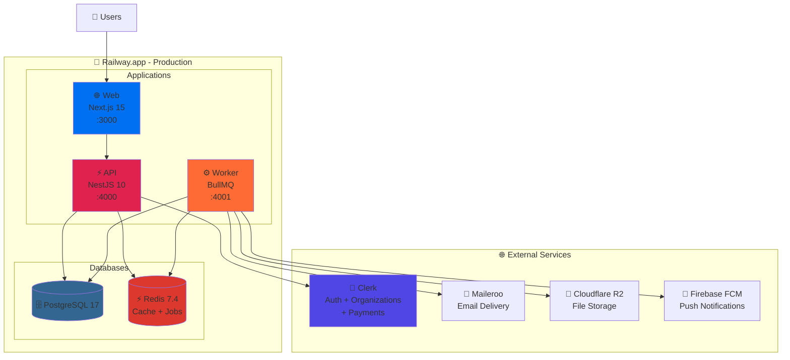

# Planday Clone - Workforce Management System

[](https://www.typescriptlang.org/)
[](https://pnpm.io/)
[](https://nextjs.org/)
[](https://nestjs.com/)
[](./LICENSE)

> **Workforce Management System** für KMUs mit 10-500 Mitarbeitern. Optimale Balance zwischen bewährten SaaS-Tools und Open Source für maximale Kosteneffizienz.

## ✅ Finale Entscheidung

Nach Evaluierung haben wir uns für eine **optimale Balance** entschieden:

### SaaS-Tools (für schnelle Entwicklung):

- 🔐 **Clerk** - Auth + Payment
- 📧 **Maileroo** - Email Delivery
- 🚂 **Railway** - Hosting

### Open Source (für Kosteneffizienz):

- 🗄️ **PostgreSQL 17** - Database
- ⚡ **Redis 7.4** - Cache & Jobs
- 📊 **Grafana + Prometheus** - Monitoring
- 📈 **Umami** - Analytics
- 🔍 **Meilisearch** - Search
- 💾 **Cloudflare R2** - File Storage
- 📱 **Firebase FCM** - Push Notifications (kostenlos!)

---

## 💰 Kosten

### 1.000 User: ~€100/Monat

```
Clerk:            $45/Monat
Maileroo:         $9/Monat
Railway:          $50/Monat
Cloudflare R2:    $1/Monat
Monitoring (OSS): $5/Monat
───────────────────────────
TOTAL:            $110/Monat
```

### vs. Full-SaaS: ~€1.200/Monat

**Ersparnis: €13.200/Jahr! 💰**

---

## 📋 Prerequisites

Bevor du startest, stelle sicher, dass folgende Software installiert ist:

- **Node.js** `22.x LTS` - [Download](https://nodejs.org/)
- **pnpm** `9.x` - Package Manager ([Installation](https://pnpm.io/installation))
  ```bash
  npm install -g pnpm@latest
  ```
- **PostgreSQL** `17.x` - Datenbank ([Download](https://www.postgresql.org/download/))
- **Redis** `7.4.x` - Cache & Job Queue ([Download](https://redis.io/download))
- **Git** - Version Control

### Externe Services (kostenlose Entwickler-Accounts):

- **Clerk** - Authentication & Payment ([Sign Up](https://clerk.com))
- **Maileroo** - Email Delivery ([Sign Up](https://maileroo.com))
- **Railway** - Hosting Platform ([Sign Up](https://railway.app))
- **Cloudflare** - R2 File Storage ([Sign Up](https://cloudflare.com))

---

## 📚 Dokumente

### 1. [Planday Clone - Open Source Konzept](./CONCEPT.md) ⭐

**HAUPT-DOKUMENT - Start hier!**

- Komplett mit Clerk + Maileroo
- Vollständiges Tech Stack
- Datenbank-Schema mit Clerk Integration
- Maileroo Email Service Setup
- Clerk Webhooks für User Sync
- Railway Deployment
- Kosten-Kalkulation

### 2. [Tech Stack Vergleich](./COMPARISON.md)

- Clerk vs. Auth.js
- Maileroo vs. SendGrid vs. Postal
- Warum hybride Lösung optimal ist
- ROI-Berechnung
- Entscheidungsmatrix

### 3. [Railway Deployment Guide](./RAILWAY_DEPLOYMENT_GUIDE.md)

- Multi-Dockerfile Setup
- Environment Variables
- Service Configuration
- CI/CD Pipeline (GitHub Actions)
- Health Checks & Monitoring
- Deployment Checkliste

### 4. [Quick Start Guide](./QUICK_START.md)

- Lokale Entwicklungsumgebung Setup
- Development Workflow
- Testing und Debugging

---

## 🎯 Warum Clerk?

✅ Schnellere Time-to-Market (2-3 Wochen gespart)
✅ Pre-built UI Components
✅ Payment integriert (Stripe managed)
✅ Multi-Tenancy built-in
✅ SSO/SAML Enterprise-ready
✅ User Management Dashboard
✅ Webhooks für Integration
✅ MFA/2FA included

**Setup: 30 Minuten statt 3 Tage**

---

## 📧 Warum Maileroo?

✅ Günstig ($9/Monat für 10k Emails)
✅ Hervorragende Deliverability
✅ EU-Server (GDPR-compliant)
✅ API + SMTP
✅ Webhooks (Bounce, Click tracking)
✅ Templates Support
✅ Schnelles Setup (30 Min)

**Alternative**: Amazon SES ($1 per 10k Emails)

---

## 🚀 Quick Start

### 1. Repository klonen und Dependencies installieren

```bash
git clone https://github.com/yourusername/quantumshiftplanner.git
cd quantumshiftplanner

# Dependencies installieren (pnpm workspace)
pnpm install
```

### 2. Environment Variables konfigurieren

```bash
# .env.example nach .env.local kopieren
cp .env.example .env.local

# Dann .env.local mit deinen API Keys ausfüllen:
# - CLERK_SECRET_KEY (von clerk.com)
# - NEXT_PUBLIC_CLERK_PUBLISHABLE_KEY
# - DATABASE_URL (PostgreSQL)
# - REDIS_URL (Redis)
# - MAILEROO_API_KEY (von maileroo.com)
```

### 3. Datenbank initialisieren

```bash
# Drizzle Schema in Datenbank pushen
pnpm db:push

# Oder Migrations verwenden
pnpm db:generate  # Generiert Migrations
pnpm db:migrate   # Führt Migrations aus
```

### 4. Entwicklungsserver starten

```bash
# Alle Services parallel starten (Web + API + Worker)
pnpm dev

# Oder einzeln:
pnpm --filter @planday/web dev      # Next.js Web auf :3000
pnpm --filter @planday/api dev      # NestJS API auf :4000
pnpm --filter @planday/worker dev   # Worker Service auf :4001
```

### 5. Testen & Validieren

```bash
# Tests ausführen
pnpm test                # Alle Tests
pnpm test:unit           # Nur Unit Tests
pnpm test:e2e            # End-to-End Tests

# Code Quality prüfen
pnpm type-check          # TypeScript Validierung
pnpm lint                # ESLint
pnpm format:check        # Prettier Formatierung
```

**Fertig! App läuft auf http://localhost:3000 🎉**

> **Detaillierte Anleitung:** Siehe [QUICK_START.md](./QUICK_START.md) für vollständiges Setup inklusive externe Services (Clerk, Maileroo, etc.)

---

## 📖 Vollständige Dokumentation

### Hauptdokument:

📄 [**Planday Clone - Konzept**](./CONCEPT.md)

- Alles was du brauchst!
- Clerk Integration
- Maileroo Setup
- Datenbank-Schema
- API-Struktur
- Railway Deployment
- Security & Compliance (Rate Limiting, GDPR, Audit Logging)
- Testing Strategy (Unit, Integration, E2E)
- Error Handling & Logging
- Database Migrations

### 📚 Available Documentation:

#### Getting Started:

1. [Quick Start Guide](./QUICK_START.md) ⭐ - Lokale Entwicklung Setup
2. [Contributing Guide](./CONTRIBUTING.md) ⭐ - Developer Onboarding
3. [Troubleshooting](./TROUBLESHOOTING.md) ⭐ - Common Issues

#### Architecture & Implementation:

4. [Tech Stack Vergleich](./COMPARISON.md) ⭐ - Warum diese Wahl?
5. [Microservices Architecture](./MICROSERVICES_ARCHITECTURE.md) ⭐ - Service Design & Communication
6. [Authentication Flow](./AUTH_FLOW.md) ⭐ - Clerk Integration Details
7. [API Reference](./API_REFERENCE.md) ⭐ - Complete REST API
8. [Mobile Architecture](./MOBILE_ARCHITECTURE.md) ⭐ - React Native App

#### Operations & Deployment:

9. [Railway Deployment Guide](./RAILWAY_DEPLOYMENT_GUIDE.md) ⭐ - Detailliertes Deployment

#### Security & Compliance:

10. [Security Policy](./SECURITY.md) ⭐ - Vulnerability Reporting

---

### 📝 Planned Documentation (Coming Soon):

- **Real-time Communication** - Socket.io Implementation
- **File Upload** - Cloudflare R2 Integration
- **Performance Optimization** - Optimization & Benchmarks
- **Monitoring** - Grafana & Observability
- **Backup & Recovery** - Disaster Recovery Plan
- **Scaling** - Horizontal & Vertical Scaling
- **Compliance** - GDPR & Legal
- **Accessibility** - WCAG 2.1 Guidelines
- **Migration Guide** - Import from Competitors
- **Internationalization** - i18n Strategy

---

## 🎯 Features - Komplett

### ✅ Alle Planday Features:

- Schichtplanung (Drag & Drop, Templates)
- Shift Swapping, Handover & Selling
- Zeiterfassung (GPS, Fotos)
- Mitarbeiterverwaltung
- Availability Management
- Urlaubs-/Krankheitsverwaltung
- In-App Messaging
- Email Notifications (Maileroo)
- Push Notifications (FCM)
- Reporting & Analytics
- Payroll Export
- Multi-Tenancy (Clerk Organizations)
- Subscription Billing (Clerk Payments)
- Mobile Apps (iOS & Android)

---

## 🛠️ Verfügbare pnpm Commands

### Development

```bash
pnpm dev                        # Alle Services parallel starten (Web + API + Worker)
pnpm --filter @planday/web dev  # Nur Web (Next.js auf :3000)
pnpm --filter @planday/api dev  # Nur API (NestJS auf :4000)
pnpm --filter @planday/worker dev # Nur Worker (BullMQ auf :4001)
```

### Build & Production

```bash
pnpm build                       # Alle Packages und Apps builden
pnpm --filter @planday/web build # Nur Web builden
pnpm --filter @planday/api build # Nur API builden
pnpm start:web                   # Web Production Server
pnpm start:api                   # API Production Server
pnpm start:worker                # Worker Production Server
```

### Testing

```bash
pnpm test                # Alle Tests (Unit + Integration)
pnpm test:unit           # Nur Unit Tests
pnpm test:integration    # Nur Integration Tests
pnpm test:e2e            # End-to-End Tests (Playwright)
pnpm test:watch          # Tests im Watch Mode
pnpm test:cov            # Tests mit Coverage Report
```

### Code Quality

```bash
pnpm lint                # ESLint für alle Workspaces
pnpm lint:fix            # ESLint mit Auto-Fix
pnpm format              # Prettier Formatierung
pnpm format:check        # Prettier Check (CI)
pnpm type-check          # TypeScript Validierung
```

### Database (Drizzle ORM)

```bash
pnpm db:generate         # Generiert Migrations aus Schema
pnpm db:migrate          # Führt Migrations aus
pnpm db:push             # Schema direkt in DB pushen (Dev only)
pnpm db:studio           # Öffnet Drizzle Studio (DB GUI auf :4983)
```

### Utilities

```bash
pnpm clean               # Alle build Artifacts löschen
pnpm install --frozen-lockfile  # Dependencies installieren (CI)
```

> **Tipp:** Alle Commands im Detail unter [CLAUDE.md](./CLAUDE.md#development-commands)

---

## 🏗️ Architektur



### Service Übersicht

| Service        | Technologie           | Port | Beschreibung          |
| -------------- | --------------------- | ---- | --------------------- |
| **Web**        | Next.js 15 + React 19 | 3000 | Frontend mit SSR/SSG  |
| **API**        | NestJS 10 + Fastify   | 4000 | REST API + WebSockets |
| **Worker**     | NestJS 10 + BullMQ    | 4001 | Background Jobs       |
| **PostgreSQL** | v17                   | 5432 | Primary Database      |
| **Redis**      | v7.4                  | 6379 | Cache + Job Queue     |

> **Monorepo:** Alle Services teilen sich Code via pnpm workspaces (`packages/types`, `packages/config`, `packages/database`)

---

## 🤝 Contributing

Wir freuen uns über Beiträge! Bitte lies den **[Contributing Guide](./CONTRIBUTING.md)** für:

- 📋 Development Workflow
- 🔧 Code Style Guidelines
- ✅ Testing Requirements
- 📝 Commit Conventions
- 🔄 Pull Request Process

### Schnellstart für Contributors:

```bash
# 1. Fork & Clone
git clone https://github.com/your-username/quantumshiftplanner.git

# 2. Branch erstellen
git checkout -b feature/your-feature-name

# 3. Entwickeln & Testen
pnpm install
pnpm dev
pnpm test

# 4. Commit & Push
git commit -m "feat: your feature description"
git push origin feature/your-feature-name

# 5. Pull Request erstellen
```

---

## 🐛 Troubleshooting

Probleme beim Setup oder Development? Check die **[Troubleshooting-Anleitung](./TROUBLESHOOTING.md)**:

**Häufige Probleme:**

- 🔴 **Port already in use:** Andere Services auf :3000, :4000 oder :4001 stoppen
- 🗄️ **Database connection failed:** PostgreSQL läuft? `DATABASE_URL` korrekt?
- ⚡ **Redis connection error:** Redis läuft? `REDIS_URL` korrekt?
- 🔐 **Clerk auth not working:** API Keys in `.env.local` gesetzt?
- 📦 **pnpm install fails:** Node.js 22.x installiert? Cache löschen: `pnpm store prune`

> **Mehr Details:** [TROUBLESHOOTING.md](./TROUBLESHOOTING.md)

---

## ✅ Next Steps

1. 📖 **[Lies das Hauptdokument](./CONCEPT.md)** - Vollständige Spezifikation
2. 🚀 **[Quick Start Guide](./QUICK_START.md)** - Detailliertes Setup (30 Min)
3. 🤝 **[Contributing Guide](./CONTRIBUTING.md)** - Für Entwickler
4. 🚂 **[Railway Deployment](./RAILWAY_DEPLOYMENT_GUIDE.md)** - Production Deployment
5. 🔐 **Erstelle Accounts:** [Clerk](https://clerk.com) · [Maileroo](https://maileroo.com) · [Railway](https://railway.app)
6. 💻 **Start Development!**

---

## 📄 License

This project is licensed under the **MIT License** - see the [LICENSE](./LICENSE) file for details.

---

## 📞 Support

- 📖 **Dokumentation:** [DOCUMENTATION_INDEX.md](./DOCUMENTATION_INDEX.md)
- 🐛 **Issues:** [GitHub Issues](https://github.com/Dropicx/quantumshiftplanner/issues)
- 🔒 **Security:** [SECURITY.md](./SECURITY.md)

---

**Let's build this! 🚀**

**Stand:** November 2025
**Tech Stack:** Next.js 15 · React 19 · NestJS 10 · PostgreSQL 17 · Redis 7.4
**License:** MIT
